# Lab 00 — Server Build

**Objective:** Build a clean Windows Server 2022 virtual machine that the deployment automation
can take over, with nothing configured beyond what installation requires.
**Environment:** VMware Workstation 17 host; new VM `Windows Server 2022` on the `vmnet8` NAT network.
**Prerequisites:** None.
**Automation:** None — this lab produces the untouched starting point the automation assumes.
**Duration:** Approximately 30 minutes, most of it unattended installation.

---

## 1. Scenario

Every later lab depends on one guarantee: the server starts in a known, unmodified state. The
automation is written against a bare evaluation image, so the build here is deliberately minimal —
no roles, no rename, no static address. Anything configured by hand at this stage would be
configuration the automation could not prove it made.

---

## 2. Design decisions

| Decision | Options considered | Selected | Rationale |
|---|---|---|---|
| Installation media | Retail ISO; evaluation ISO; Azure VM | Evaluation ISO (180-day) | Free, full-featured Datacenter edition, and representative of the trimmed component stores that break role installs — a failure mode the automation now handles (see [Lab 02](../02-automated-forest-deployment/)). |
| Edition | Standard; Datacenter; Core vs Desktop Experience | Datacenter, Desktop Experience | Desktop Experience allows the console-based evidence captured in later labs. Server Core is the production preference for a DC and is noted as such. |
| Network type | Bridged; NAT; host-only | NAT | Internet access for updates and module installs without exposing a lab DHCP/DNS server to the physical LAN. See [environment.md §3](../../docs/environment.md#3-addressing). |
| Sizing | Deployment minimum (4 GB / 20 GB free); larger | 4 vCPU, 8 GB, 60 GB | Headroom so that role installation and promotion are not memory-bound. |
| Server configuration during install | Rename and address by hand; leave defaults | Leave defaults | The automation renames before promotion and pins the address itself. Doing either by hand would hide whether the code does it correctly. |

---

## 3. Implementation

### Step 1 — Obtain the evaluation media

Downloaded the Windows Server 2022 64-bit ISO from the Microsoft Evaluation Center.

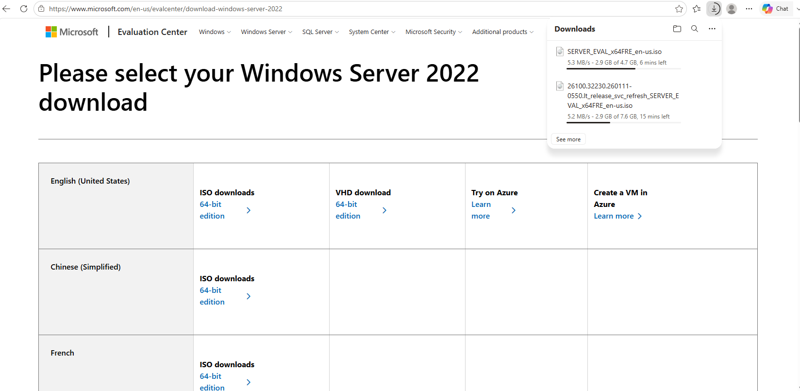

The Evaluation Center download page with the Windows Server 2022 evaluation ISO in progress.

---

### Step 2 — Create the virtual machine

**VMware Workstation → File → New Virtual Machine → Typical**, installer disc image file set to
the downloaded ISO. Workstation detects the guest OS and offers Easy Install.

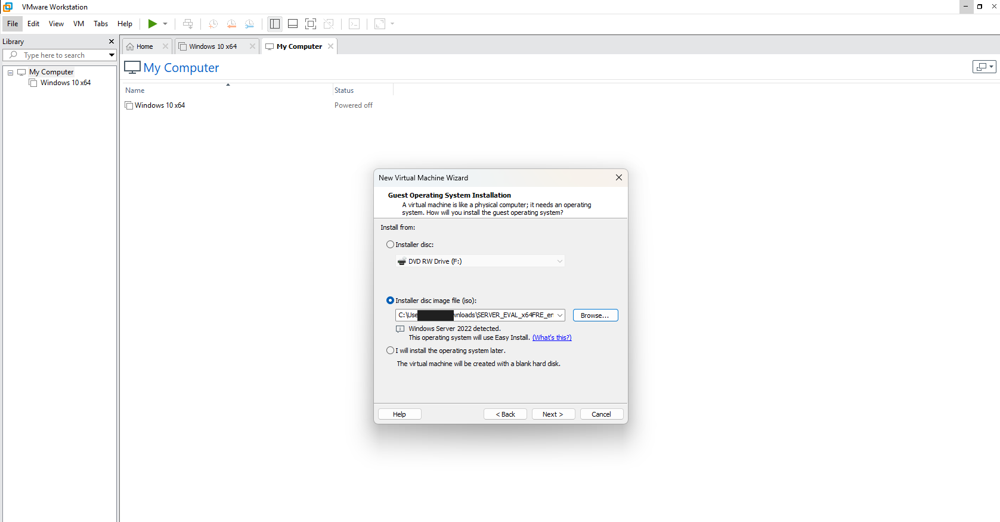

The wizard pointed at the evaluation ISO, with Windows Server 2022 detected for Easy Install.

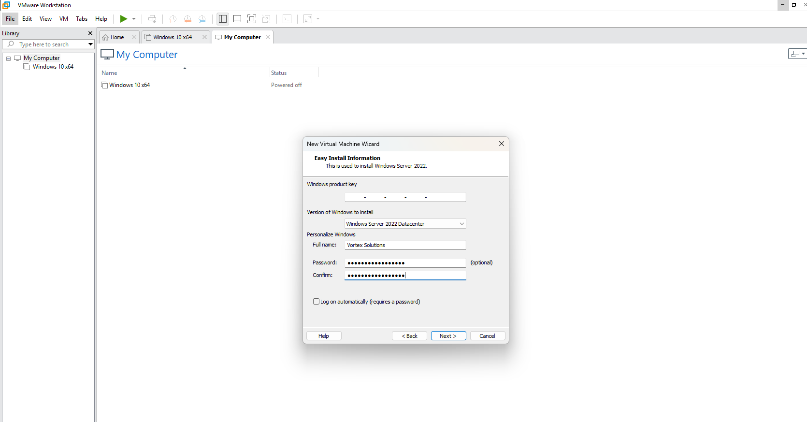

Easy Install set to Datacenter with no product key, as the evaluation licence requires.

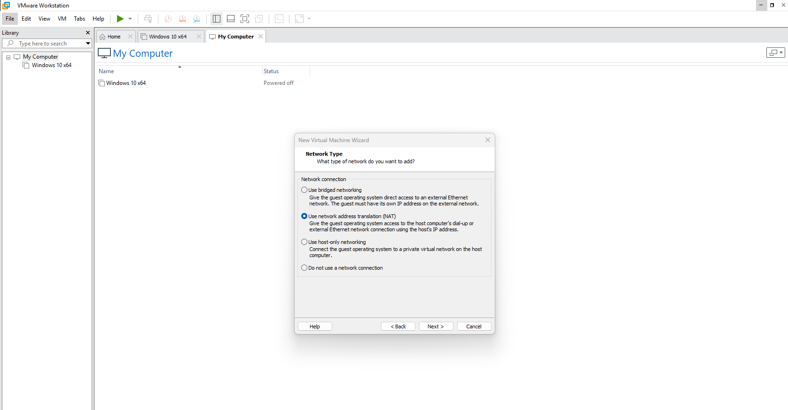

Network adapter set to NAT, isolating the lab network behind the host.

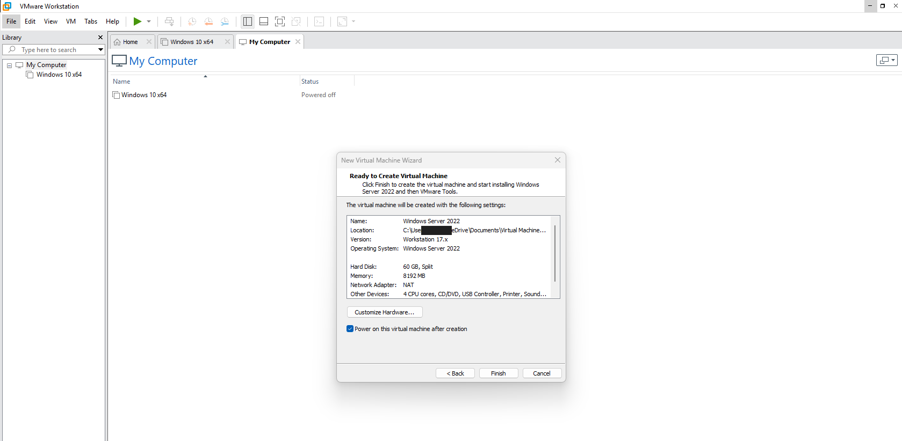

The final hardware summary before creation: 60 GB split disk, 8 GB memory, NAT, 4 CPU cores.

---

### Step 3 — Install Windows Server

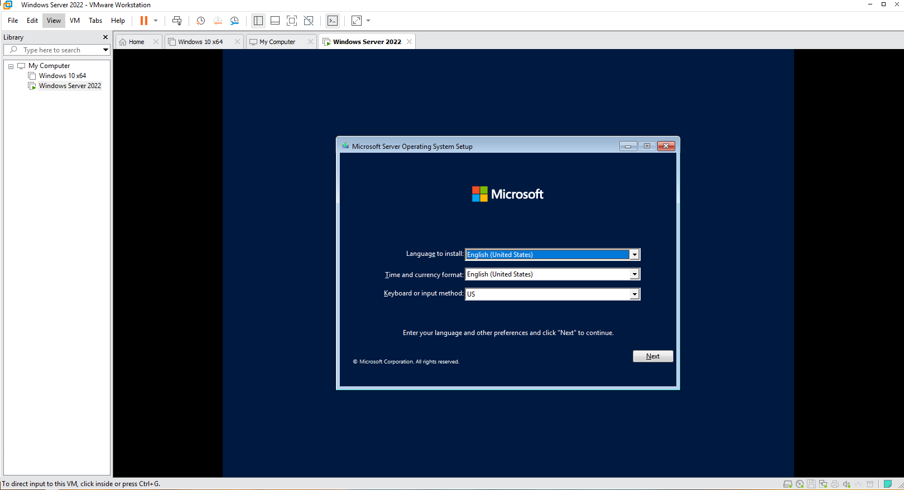

Windows Setup starting inside the VM.

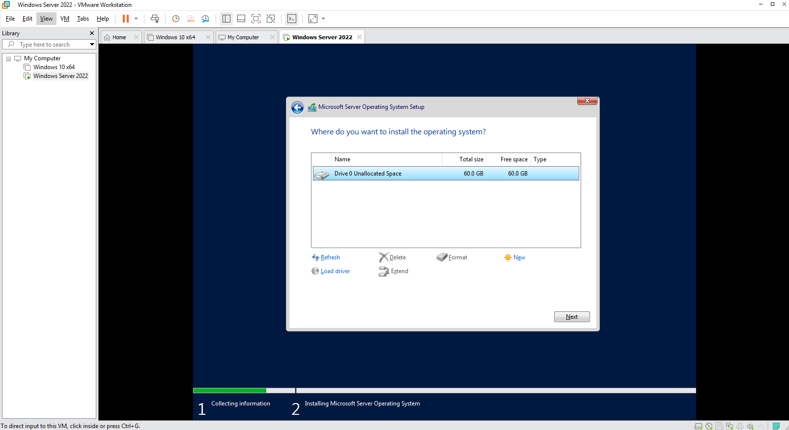

The single 60 GB virtual disk selected as the installation target.

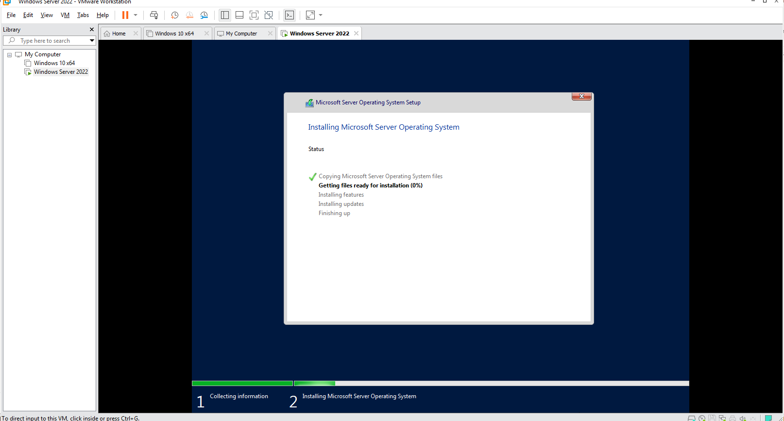

Files copying; the rest of installation runs unattended.

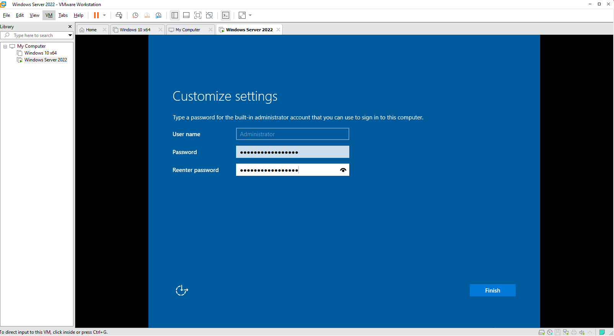

The built-in Administrator password set at the end of setup — the only credential typed by hand
in the entire build.

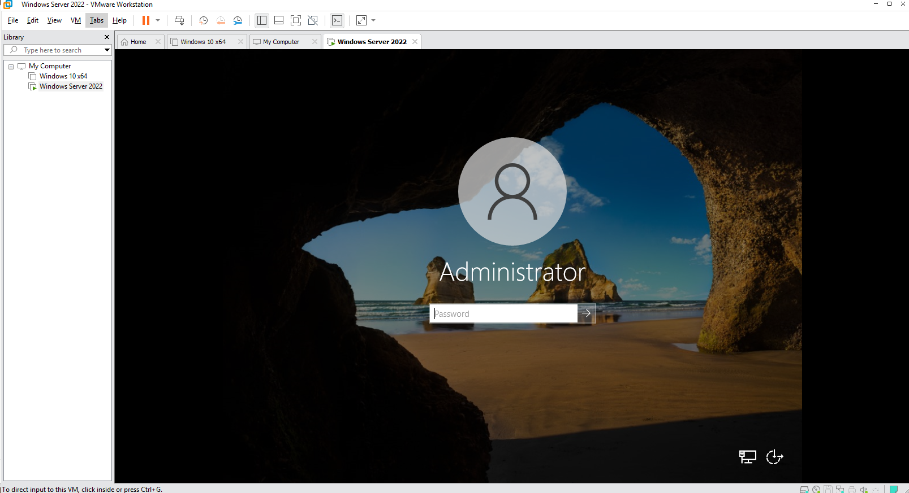

First boot to the sign-in screen as the local Administrator.

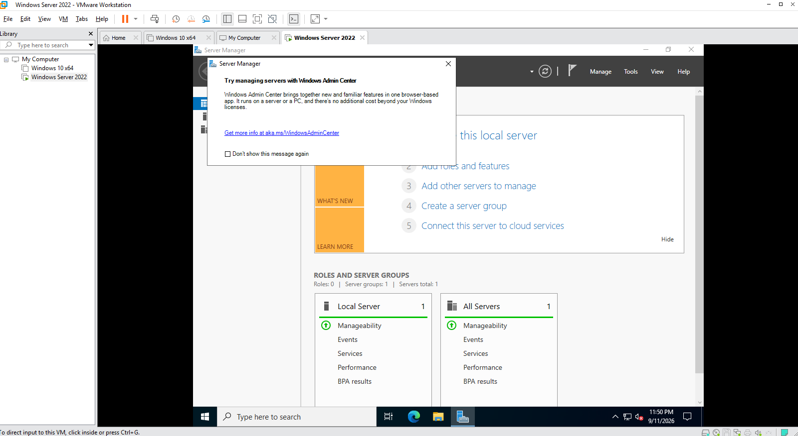

Server Manager on first boot: `Roles: 0`, a clean server with the default `WIN-` computer name
and a DHCP address.

> **Checkpoint.** A VMware snapshot of this state is the rollback point for every later lab.
> The deployment runbook makes the same recommendation before the automation runs.

---

## 4. Verification

| Check | Command | Success criterion |
|---|---|---|
| OS build | `Get-CimInstance Win32_OperatingSystem \| Select Caption, BuildNumber` | Windows Server 2022 Datacenter Evaluation, build 20348 |
| No roles installed | `Get-WindowsFeature \| Where Installed -and FeatureType -eq Role` | No AD DS, DNS, IIS |
| Address still DHCP | `Get-NetIPAddress -AddressFamily IPv4 \| Select IPAddress, PrefixOrigin` | `PrefixOrigin` is `Dhcp` |

The first-boot Server Manager screenshot (`Roles: 0`) is the recorded evidence for the second
check.

---

## 5. Faults encountered

No faults were encountered during this lab.

---

## 6. Capabilities demonstrated

- Windows Server 2022 installation and virtual machine provisioning in VMware Workstation
- Virtual network selection with an explicit isolation rationale
- Establishing a known-good baseline before automation, rather than configuring by hand

---

## 7. References

| Source | Behaviour confirmed |
|---|---|
| Microsoft Learn — *Windows Server 2022 system requirements* | Minimum memory and disk for Desktop Experience |
| Microsoft Evaluation Center — *Windows Server 2022* | 180-day evaluation, Datacenter edition availability |
| VMware Docs — *Configuring Network Address Translation* | `vmnet8` NAT behaviour and DHCP pool range |

---

## Screenshot checklist

| File | Content |
|---|---|
| `00-01-evaluation-iso-download.png` | Evaluation ISO download |
| `00-02-new-vm-iso-selected.png` | New VM wizard, ISO detected |
| `00-03-easy-install-details.png` | Easy Install edition |
| `00-04-network-type-nat.png` | NAT network type |
| `00-05-vm-hardware-summary.png` | Hardware summary |
| `00-06-setup-language.png` | Setup start |
| `00-07-install-target-disk.png` | Target disk |
| `00-08-installing-os.png` | Installation in progress |
| `00-09-administrator-password.png` | Administrator password |
| `00-10-first-sign-in.png` | First sign-in |
| `00-11-server-manager-first-boot.png` | Server Manager, no roles |
