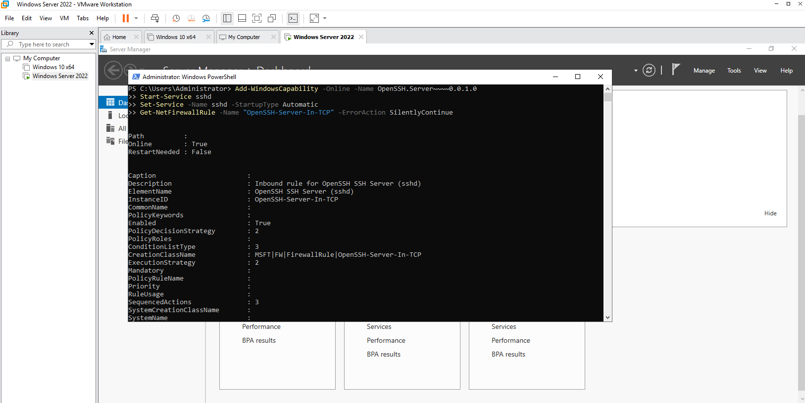
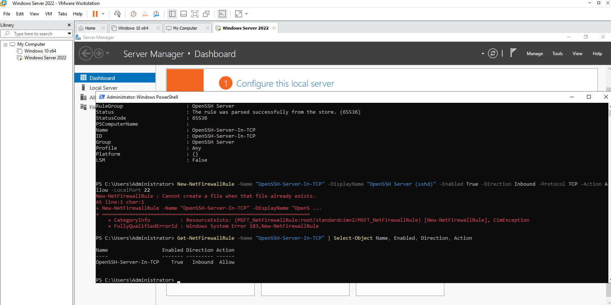
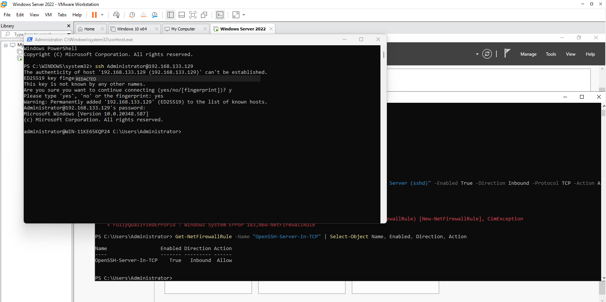
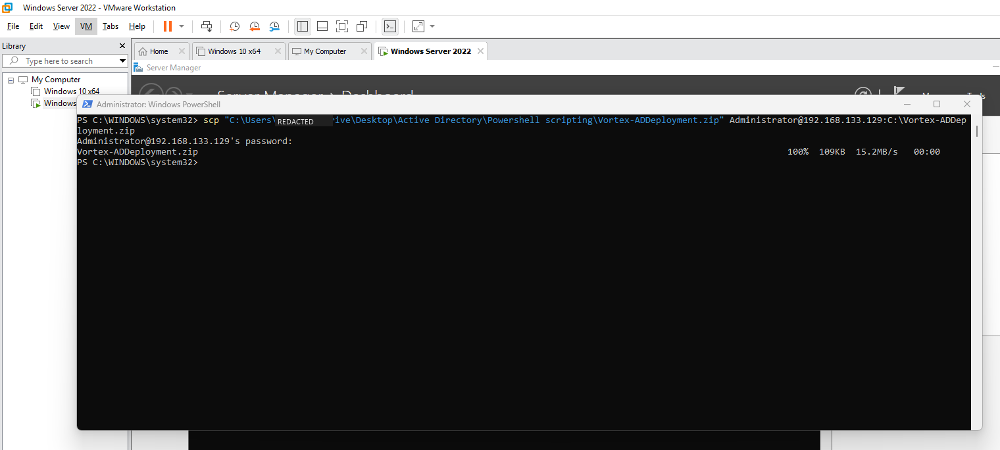
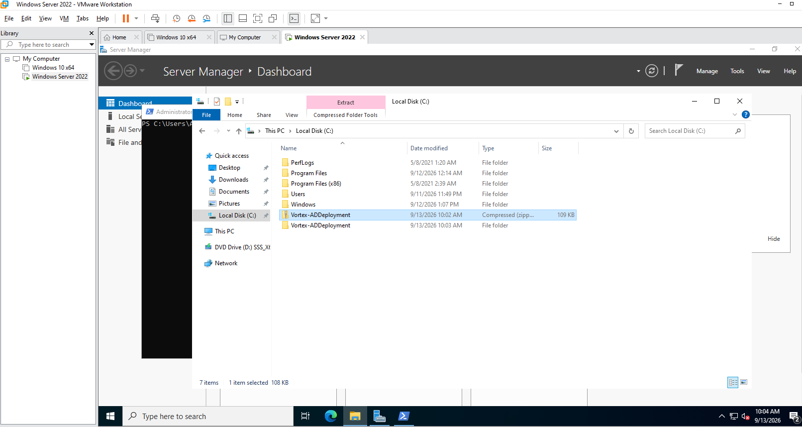
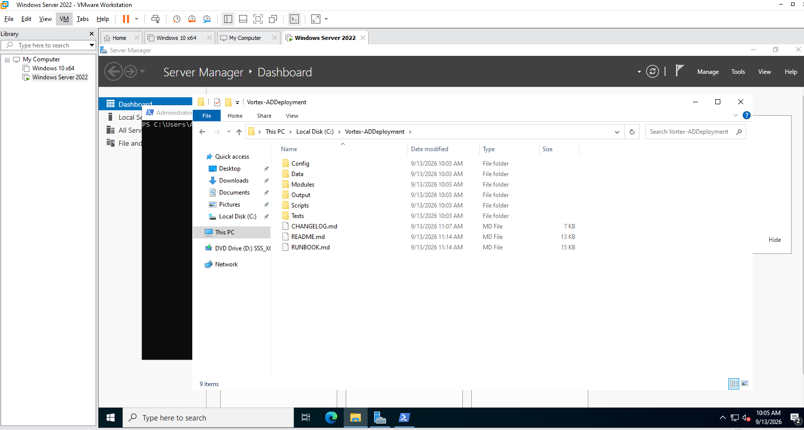
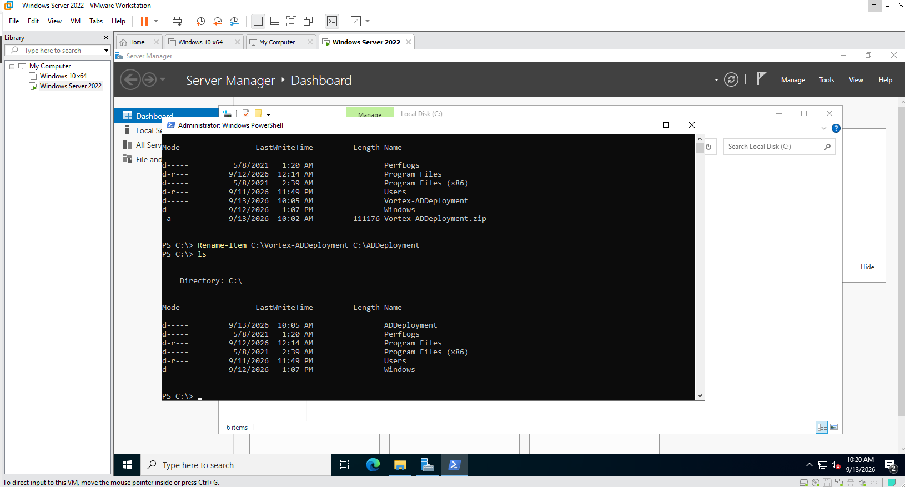
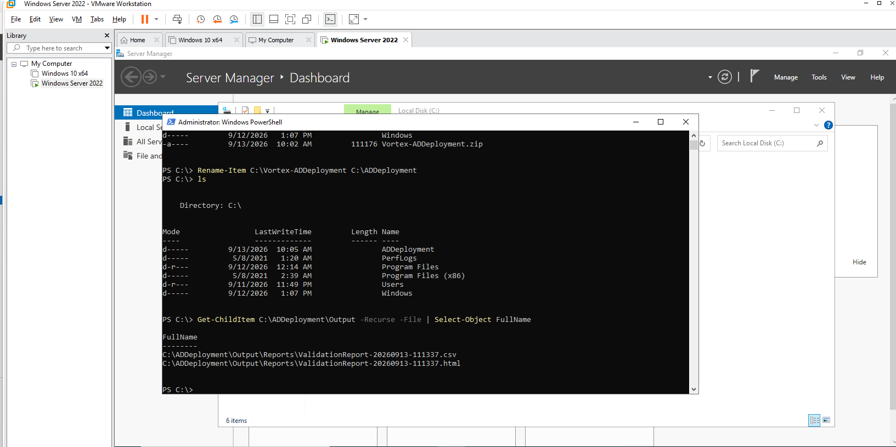

# Lab 01 — Remote Access and Kit Transfer

**Objective:** Get the deployment kit onto the new server intact and unblocked, over an encrypted
channel, without depending on VMware Tools or shared folders.
**Environment:** Windows 11 host → `WIN-11KE65KQP24` (the unrenamed server from Lab 00), `192.168.133.129`.
**Prerequisites:** Lab 00.
**Automation:** None — this lab stages the automation.
**Duration:** Approximately 15 minutes.

---

## 1. Scenario

The deployment has to run *on* the server, but it is authored and version-controlled on the host.
Copy-paste through a VM console mangles line endings and drops files; shared folders need VMware
Tools and leave a live path from the guest back into the host. The requirement is a transfer that
is encrypted, scriptable, and leaves nothing behind once the build is running.

---

## 2. Design decisions

| Decision | Options considered | Selected | Rationale |
|---|---|---|---|
| Transfer channel | Drag and drop (VMware Tools); VMware shared folder; ISO; OpenSSH `scp` | OpenSSH `scp` | Encrypted, built into Windows Server 2022 as a capability, and the same mechanism works against a remote or cloud-hosted server. No standing host-to-guest path. |
| Enabling SSH | Via the automation; by hand at the console | By hand, once, at the console | A chicken-and-egg step: SSH cannot be used to enable SSH. It is the single manual change before the automation takes over. |
| Packaging | Copy the folder; zip then copy | Zip then copy | One file in transit, one integrity point, and `Expand-Archive` preserves the folder layout exactly. |
| On-server location | Anywhere; a fixed path | `C:\ADDeployment` | `Paths.DeploymentRoot` in the configuration. Data paths are relative to it, so the kit also works elsewhere if the root is overridden. |

---

## 3. Implementation

### Step 1 — Enable OpenSSH Server from the VM console

```powershell
Add-WindowsCapability -Online -Name OpenSSH.Server~~~~0.0.1.0
Start-Service sshd
Set-Service -Name sshd -StartupType Automatic
Get-NetFirewallRule -Name 'OpenSSH-Server-In-TCP' -ErrorAction SilentlyContinue
```



The OpenSSH Server capability installed (`Online : True`, no restart needed) and the inbound
firewall rule it creates already present.



A redundant `New-NetFirewallRule` fails because the capability had already created the rule —
harmless, and the follow-up query confirms `OpenSSH-Server-In-TCP` is enabled, inbound, allow.

---

### Step 2 — Connect from the host

```powershell
ssh Administrator@192.168.133.129
```



First connection: the server's ED25519 host key is accepted and recorded, and the session lands at
`administrator@WIN-11KE65KQP24`. The fingerprint is redacted.

---

### Step 3 — Copy the kit

```powershell
scp ".\Vortex-ADDeployment.zip" Administrator@192.168.133.129:C:\Vortex-ADDeployment.zip
```



The zipped kit (109 KB) transferred over SCP.

---

### Step 4 — Extract, check, and rename

```powershell
Expand-Archive C:\Vortex-ADDeployment.zip -DestinationPath C:\Vortex-ADDeployment
Rename-Item C:\Vortex-ADDeployment C:\ADDeployment
```

Files copied from another machine carry a Mark-of-the-Web stream, and a module imported from them
is refused under a restrictive execution policy. The runbook unblocks them before the first run
(`Get-ChildItem C:\ADDeployment -Recurse -File | Unblock-File`); that command was not captured in
the screenshots below.



The archive and its extracted folder at the root of `C:`.



The kit layout as the orchestrator expects it — `Config`, `Data`, `Modules`, `Scripts`, `Tests` —
plus an empty `Output` folder and the documentation.



Renamed to `C:\ADDeployment`, the configured deployment root.



A recursive listing of `C:\ADDeployment\Output`, taken after the first deployment attempt later
that morning: only the two validation reports from that run — no state file, transcript, or
credential file copied in from the host.

---

## 4. Verification

| Check | Command | Success criterion |
|---|---|---|
| SSH service | `Get-Service sshd` | `Running`, startup type `Automatic` |
| Firewall | `Get-NetFirewallRule -Name OpenSSH-Server-In-TCP` | `Enabled True`, `Inbound`, `Allow` |
| Kit layout | `Get-ChildItem C:\ADDeployment` | `Config`, `Data`, `Modules`, `Scripts`, `Tests` directly inside |
| Files unblocked | `Get-Item C:\ADDeployment\Scripts\Invoke-Deployment.ps1 -Stream Zone.Identifier` | No such stream (not captured in this run's evidence) |

---

## 5. Faults encountered

### 5.1 `New-NetFirewallRule`: "Cannot create a file when that file already exists"

**Symptom.** Creating the inbound SSH rule failed with `Windows System Error 183`.

**Diagnosis.** `Get-NetFirewallRule -Name 'OpenSSH-Server-In-TCP'` returned an existing, enabled
rule.

**Cause.** Installing the `OpenSSH.Server` capability on Windows Server 2022 creates the firewall
rule itself. The manual creation step, carried over from older guidance, was redundant.

**Resolution.** None required — the existing rule was verified as enabled, inbound, allow. Guidance
in this repository queries the rule rather than creating it.

---

## 6. Capabilities demonstrated

- Enabling and securing OpenSSH Server on Windows Server
- Encrypted file transfer with `scp` and on-server staging of automation
- Reading an error as a signal about existing state rather than a failure
- Handling Mark-of-the-Web (`Unblock-File`) on scripts copied between machines

---

## 7. References

| Source | Behaviour confirmed |
|---|---|
| Microsoft Learn — *Get started with OpenSSH for Windows* | Capability name, service configuration, automatic firewall rule |
| Microsoft Learn — *Unblock-File* | Removal of the `Zone.Identifier` stream on downloaded files |

---

## Screenshot checklist

| File | Content |
|---|---|
| `01-01-enable-openssh.png` | OpenSSH capability install |
| `01-02-openssh-firewall-rule.png` | Firewall rule confirmed |
| `01-03-ssh-session-established.png` | SSH session (fingerprint redacted) |
| `01-04-kit-copied-over-scp.png` | SCP transfer (host path redacted) |
| `01-05-kit-on-server.png` | Archive on the server |
| `01-06-kit-contents.png` | Kit layout |
| `01-07-kit-renamed.png` | Renamed to `C:\ADDeployment` |
| `01-08-output-folder-check.png` | Output folder contents |
