# Lab 02 — Automated Forest Deployment

**Objective:** Turn the staged server into the first domain controller of a new forest from one
command — addressing, rename, role installation and promotion — surviving two restarts without a
stored credential or Windows auto-logon.
**Environment:** `WIN-11KE65KQP24` → `VTX-DC01`, `192.168.133.129`, forest `vortexai.local`.
**Prerequisites:** Labs 00, 01.
**Automation:** [`Invoke-Deployment.ps1`](../../Deployment/Scripts/Invoke-Deployment.ps1) — Stages 0, 1 and 2.
**Duration:** Approximately 15 minutes, including two automatic restarts.

---

## 1. Scenario

A domain controller build is a sequence of steps separated by restarts, and restarts are where
unattended automation usually cheats — by storing the administrator password so something can
log back in. The requirement here is a pipeline that restarts itself twice, resumes where it left
off, and never writes a reusable administrator credential anywhere on the server.

---

## 2. Design decisions

| Decision | Options considered | Selected | Rationale |
|---|---|---|---|
| Surviving restarts | Windows auto-logon; scheduled task with a stored credential; scheduled task as `NT AUTHORITY\SYSTEM` | Task as `SYSTEM`, trigger `AtStartup` | Auto-logon stores the administrator password as reversible plaintext in the registry and leaves a privileged console session. A stored credential is captured as `MACHINE\Administrator` while in a workgroup — promotion retires the local SAM account and the rename changes the machine name, so it goes stale twice. `SYSTEM` is unaffected by either and needs no password. |
| When to rename | After promotion; before promotion | Before (Stage 1) | Renaming a *domain controller* means reissuing service principal names and rewriting DNS records. Stage 2 refuses to promote if the name is not what configuration says. |
| DSRM password | Reuse the administrator password; prompt; generate | Generate (24 characters), written to disk **before** promotion, protected with machine-scoped DPAPI | A break-glass credential should be strong and recorded. Writing it first means a successful promotion can never leave a DSRM password nobody holds. |
| Failure handling | Start over; resume | Resume from a state file | `Output\deployment-state.json` records every completed step. A failure stops the pipeline without restarting the server; re-running continues from the first incomplete step. |
| Forest functional level | Windows Server 2016; 2025 | 2016 (the 2022 default) | Raising the level is not readily reversible and sets the minimum OS of any future DC. |

---

## 3. Implementation

### Step 1 — The orchestrator

`Invoke-Deployment.ps1` is the only script started by hand. It owns the stage list, tracks
progress, and re-registers itself to run after each restart.

```
0  Preflight                read-only; refuses to start what cannot finish
1  Initialize-Server        addressing, computer name, role binaries      → restart
2  Install-ADForest         DSRM password, forest promotion               → restart
3  Configure-ADEnvironment  OUs, groups, users, folders, shares, FTP        (Lab 03)
4  Baseline                 Recycle Bin, DNS, time, password policy, audit (Lab 04)
5  Validate                 PASS/FAIL report, HTML + CSV                   (Lab 04)
```

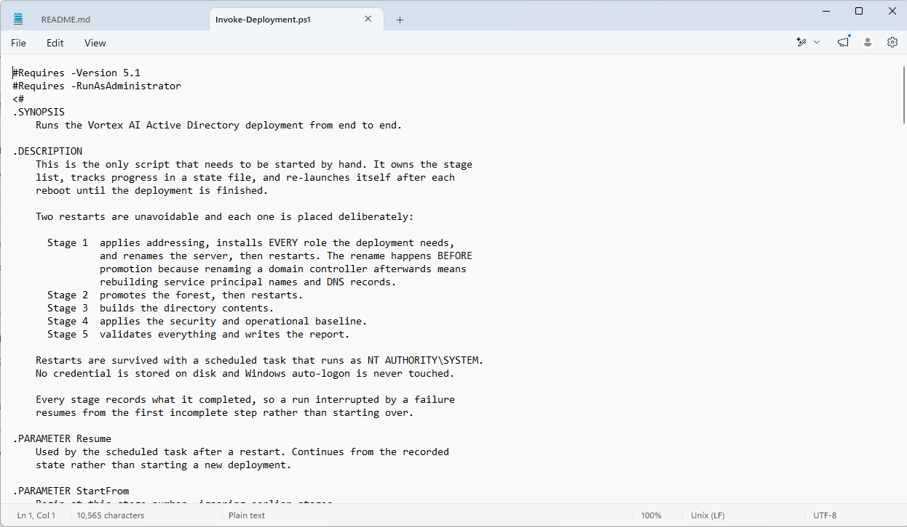

The orchestrator's own help text: the stage list, why exactly two restarts are unavoidable, and
the `SYSTEM` task that carries the run across them.

---

### Step 2 — The design this replaced

Before the rewrite, the kit kicked off Stage 1 from a scheduled task registered with an
interactively captured administrator credential.

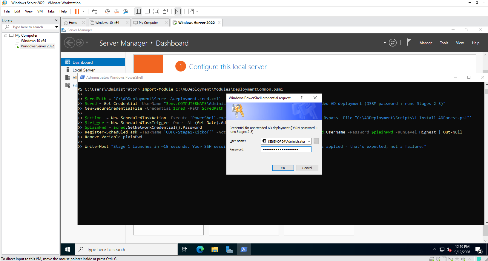

The superseded approach, run on 12 September: a credential saved to
`Secrets\deployment.cred.xml`, converted back to plaintext, and passed to
`Register-ScheduledTask -Password`. This is the design reviewed and rejected in §5.1.

---

### Step 3 — Run the deployment

```powershell
C:\ADDeployment\Scripts\Invoke-Deployment.ps1
```

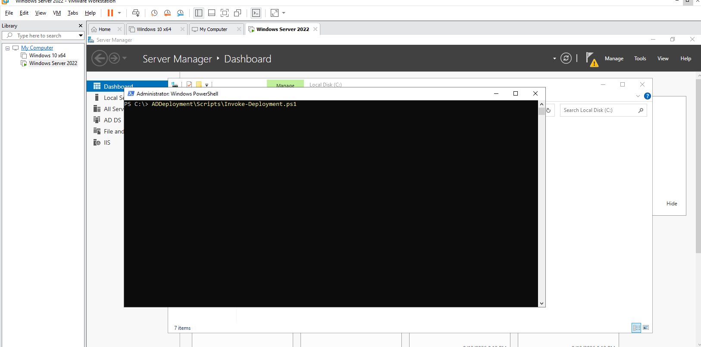

The single command that starts the build.

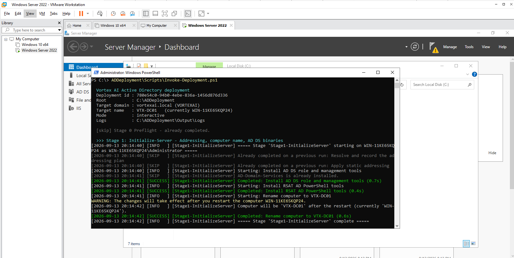

Stage 1 on the resumed run. `[SKIP]` lines show steps recorded complete by an earlier run being
passed over rather than repeated; the role binaries install and the computer is renamed to
`VTX-DC01` (effective after restart).

---

### Step 4 — Restart 1: rename and roles take effect

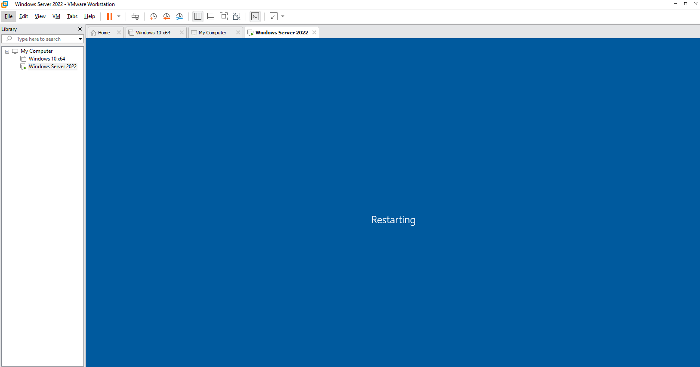

The first automatic restart, requested by the orchestrator at the end of Stage 1.

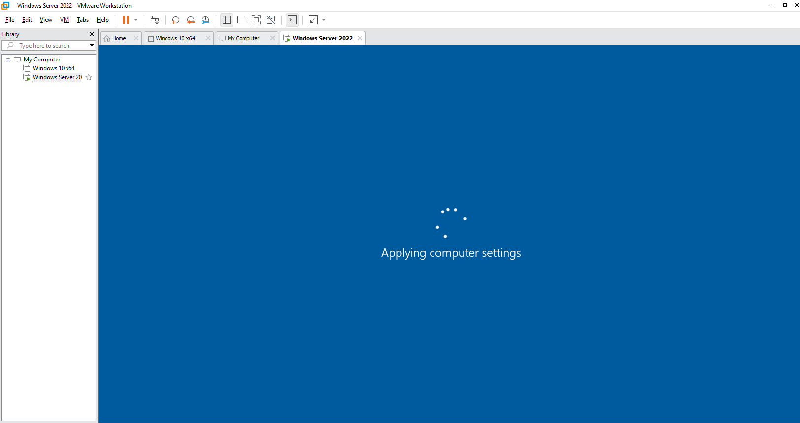

The rename being applied during boot.

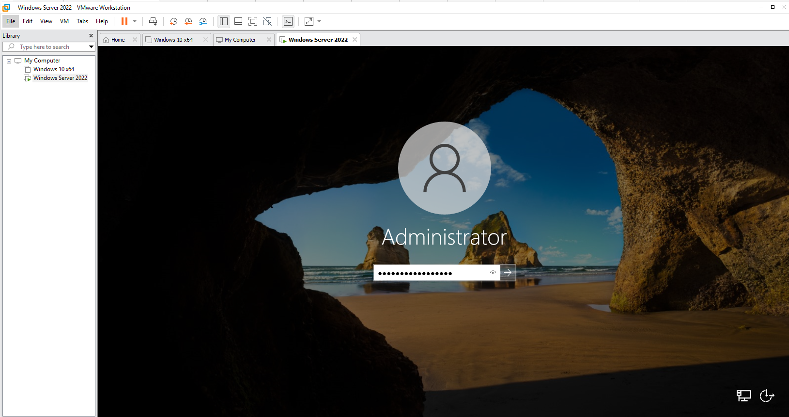

Signing in as the local Administrator to observe progress before promotion. The resume task runs in session 0 regardless — no sign-in is
required for the pipeline to continue.

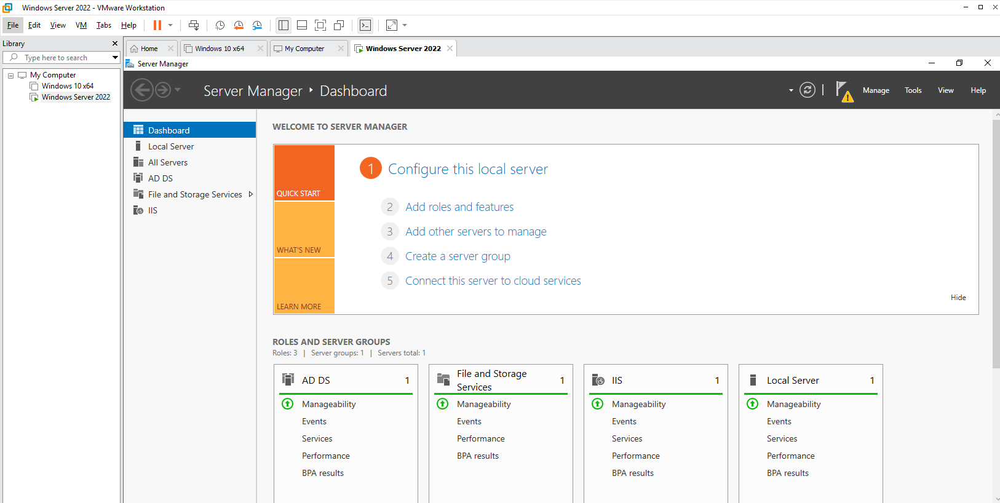

Server Manager before promotion: AD DS binaries, File and Storage Services and IIS present, and
no DNS role — DNS is installed by the promotion itself.

---

### Step 5 — Restart 2: promotion completes

Stage 2 generates and protects the DSRM password, promotes the server into the new forest, and
requests the second restart.

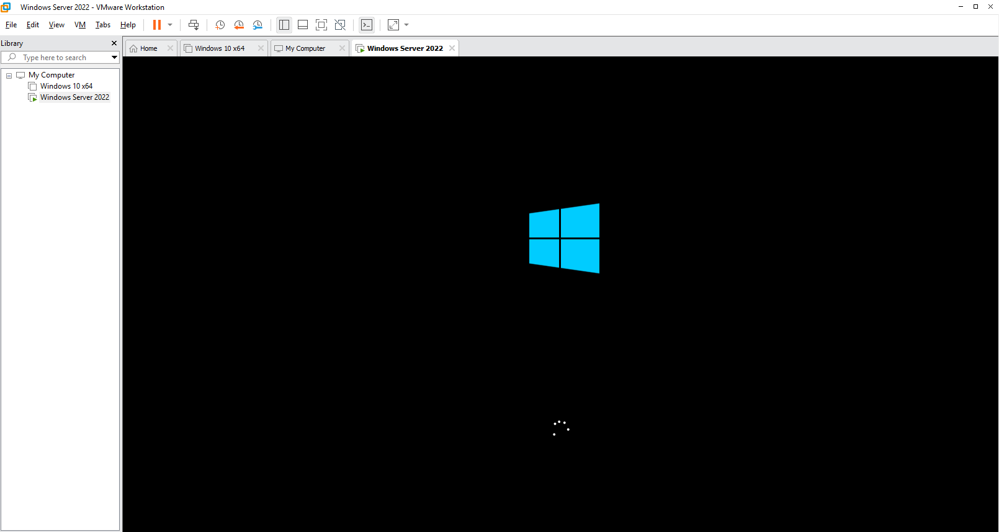

The post-promotion restart beginning.

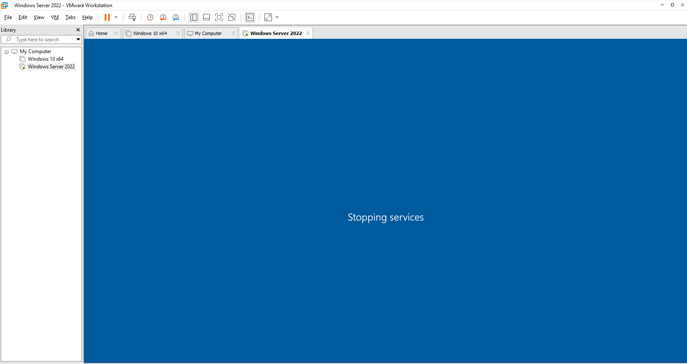

Services stopping ahead of the restart.

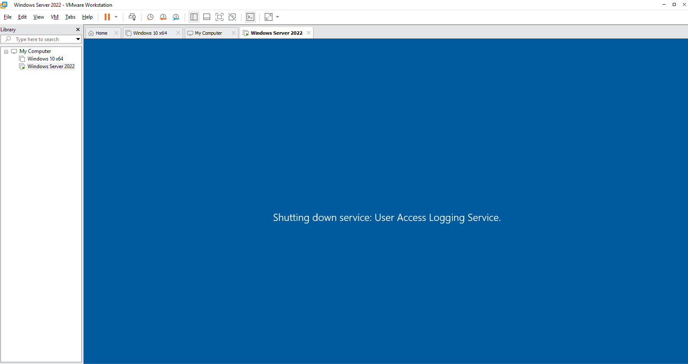

The server booting as a domain controller.

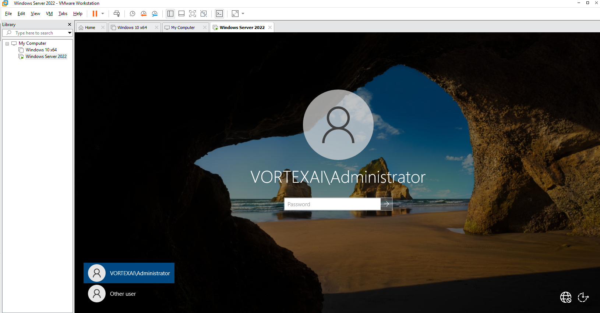

The sign-in screen now offers `VORTEXAI\Administrator` — the local SAM account has become the
domain's built-in administrator.

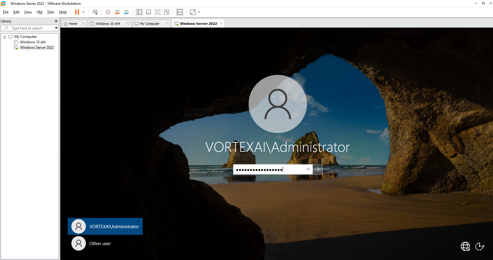

Signing in with the domain account.

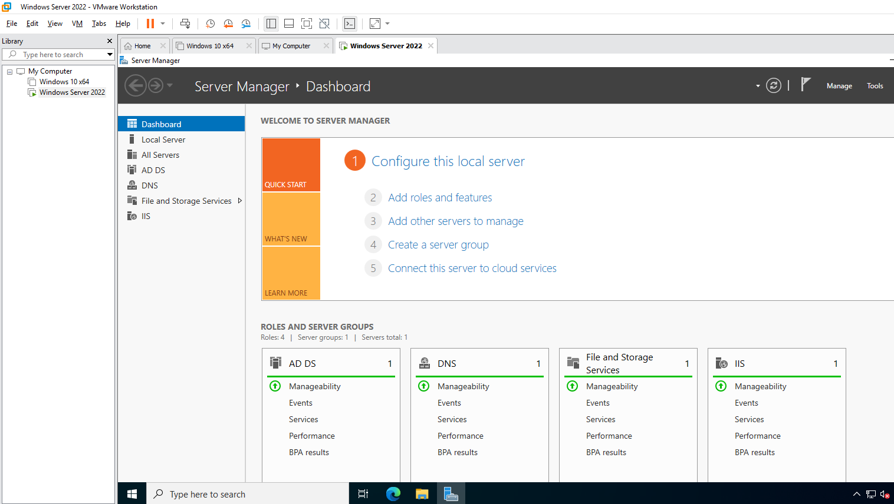

Four roles after promotion: DNS has joined AD DS, File and Storage Services and IIS.

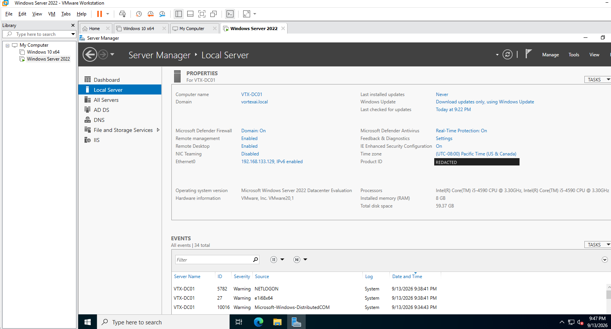

`VTX-DC01` in domain `vortexai.local` at `192.168.133.129`. Windows product ID redacted.

---

## 4. Verification

| Check | Command | Success criterion |
|---|---|---|
| Computer name | `$env:COMPUTERNAME` | `VTX-DC01` |
| Domain | `Get-ADDomain \| Select DNSRoot, NetBIOSName` | `vortexai.local`, `VORTEXAI` |
| DC role | `(Get-CimInstance Win32_OperatingSystem).ProductType` | `2` (domain controller) |
| Services | `Get-Service NTDS, ADWS, DNS, Netlogon, kdc` | All `Running` |
| No auto-logon | `Get-ItemProperty 'HKLM:\SOFTWARE\Microsoft\Windows NT\CurrentVersion\Winlogon'` | `DefaultPassword` absent |
| Progress | `Get-Content C:\ADDeployment\Output\deployment-state.json` | Stages 1 and 2 recorded complete |

All but the last are asserted automatically by Stage 5 — see [Lab 04](../04-baseline-and-validation/),
where the validation report shows each as `PASS`.

---

## 5. Faults encountered

### 5.1 Restart survival depended on a stored administrator credential

**Symptom.** None at runtime — the superseded design worked. This is a gap found on design review
(Step 2 screenshot).

**Diagnosis.** Tracing the credential's lifecycle through the build: captured as
`WIN-…\Administrator` in a workgroup; the account is retired into the domain at promotion; the
machine is renamed at Stage 1. The stored principal was invalid after both events, and the
plaintext password passed through a variable and into a scheduled task definition on the way.

**Cause.** Restart survival was designed around "log back in as the administrator" rather than
around what actually needs to run.

**Resolution.** Rewritten (version 2.0.0) to a startup task running as `NT AUTHORITY\SYSTEM`.
The credential file mechanism and the auto-logon restore script were deleted. Stage 5 asserts
there is no plaintext password in the Winlogon registry key.

### 5.2 Two runs failed on `.Count` of a single-item result

**Symptom.** Stages stopped with property-not-found errors on `.Count` against a correctly
configured server.

**Diagnosis.** The failing expressions all read `.Count` on the result of a filter or an `if`
expression, and failed only when that result held exactly one object.

**Cause.** `Set-StrictMode -Version 2.0` rejects reading a property that does not exist.
PowerShell 5.1 unrolls a one-element array to a scalar and synthesises `.Count` on it — a
convenience StrictMode 2.0 does not recognise — so `if ($x.Count -gt 0)` threw only when exactly
one item matched.

**Resolution.** Array handling fixed at source with `@()` guards; StrictMode lowered to 1.0 as a
safety net, keeping the uninitialised-variable check. Because every step is recorded in the state
file, the failed runs did not have to start over — the `[SKIP]` lines in the Step 3 screenshot are
that mechanism carrying earlier progress forward. The failing console output was not captured;
the fault and fix are recorded in the [CHANGELOG](../../docs/CHANGELOG.md).

### 5.3 Evidence was captured on 2.0.0; the published code is 2.1.0

**Symptom.** Stage 1's step names in the Step 3 screenshot ("Install AD DS role and management
tools", "Install RSAT AD PowerShell tools") differ from the committed code ("Install every Windows
role the deployment needs").

**Cause.** After this run, 2.1.0 consolidated every role install into Stage 1 — so a missing
component payload (`0x800f081f`, common on evaluation images) fails while an operator is watching,
rather than unattended at Stage 3 as `SYSTEM` — and added automatic recovery that locates
installation media and retries. See [CHANGELOG](../../docs/CHANGELOG.md).

**Resolution.** Recorded here rather than re-captured. The 2.1.0 changes are covered by the
Pester suite and CI; they have not been re-run end to end on this VM.

---

## 6. Capabilities demonstrated

- AD DS forest deployment and domain controller promotion with `Install-ADDSForest`
- Unattended multi-restart orchestration with idempotent, resumable steps
- Secure automation design: `SYSTEM` startup task, generated DSRM password, DPAPI-protected secret
- Design review of an insecure credential pattern and its replacement
- PowerShell 5.1 pipeline and StrictMode behaviour diagnosis

---

## 7. References

| Source | Behaviour confirmed |
|---|---|
| Microsoft Learn — *Install-ADDSForest* | Unattended promotion parameters and `SafeModeAdministratorPassword` |
| Microsoft Learn — *Rename a domain controller* | Why renaming after promotion is a separate, involved procedure |
| Microsoft Learn — *Configure Windows to automate logon* | `DefaultPassword` stored in plaintext in the Winlogon key |
| Microsoft Learn — *Set-StrictMode* | Version 2.0 property-access rules |

---

## Screenshot checklist

| File | Content |
|---|---|
| `02-01-orchestrator-source.png` | Orchestrator help text |
| `02-02-superseded-stored-credential-design.png` | Rejected stored-credential design |
| `02-03-deployment-started.png` | Deployment command |
| `02-04-stage1-output.png` | Stage 1 output (resumed run) |
| `02-05-first-restart.png` | Restart 1 |
| `02-06-applying-computer-settings.png` | Rename applying |
| `02-07-local-administrator-sign-in.png` | Sign-in after restart 1 |
| `02-08-roles-before-promotion.png` | Roles before promotion |
| `02-09-second-restart-shutdown.png` | Restart 2 shutdown |
| `02-10-stopping-services.png` | Services stopping |
| `02-11-second-restart-boot.png` | Boot as DC |
| `02-12-domain-administrator-sign-in.png` | Domain sign-in offered |
| `02-13-domain-administrator-password.png` | Domain sign-in |
| `02-14-roles-after-promotion.png` | Roles after promotion |
| `02-15-dc-local-server-properties.png` | DC properties (product ID redacted) |
