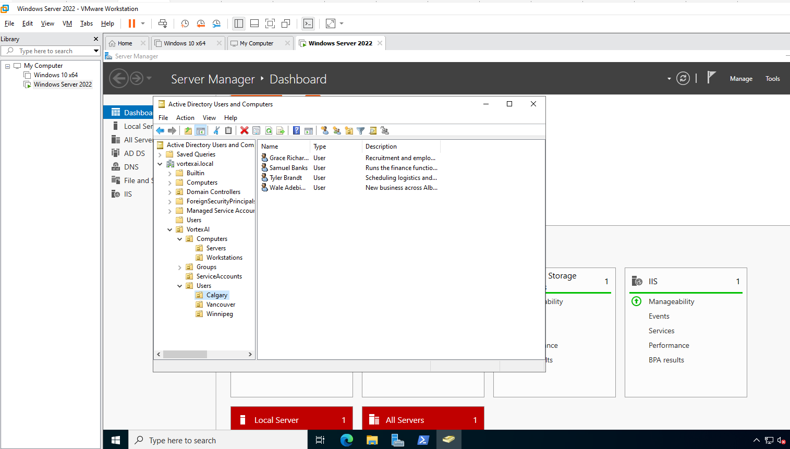
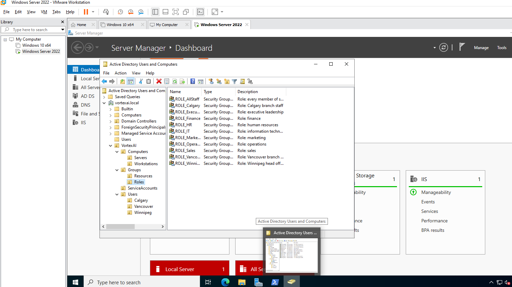
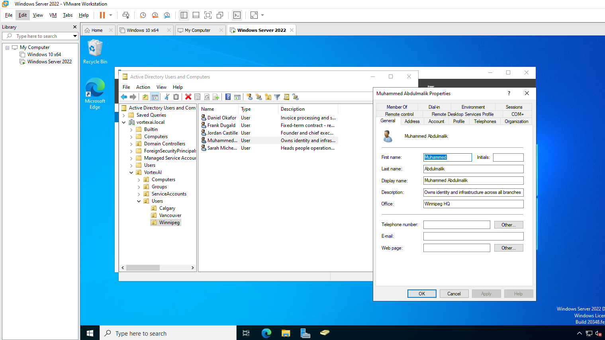
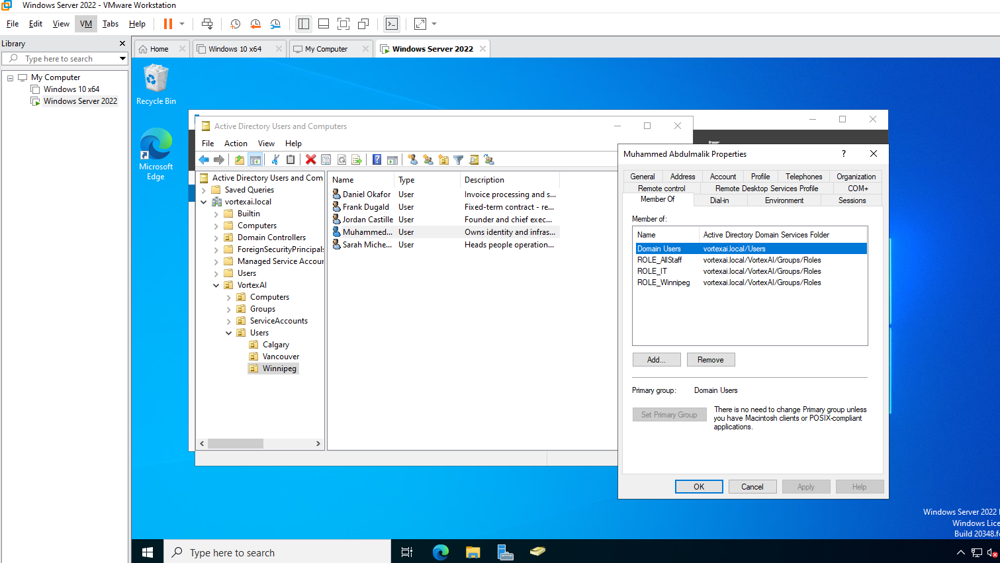
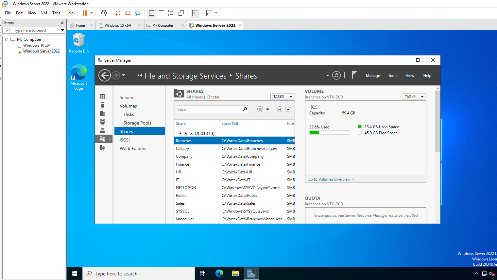

# Lab 03 — Directory Build: OUs, AGDLP Groups, Users and Shares

**Objective:** Populate the new domain from configuration — a delegable OU tree, an AGDLP group
model, 15 accounts from a CSV identity feed, and 11 permissioned SMB shares — with no object
created by hand.
**Environment:** `VTX-DC01`, domain `vortexai.local`.
**Prerequisites:** Lab 02.
**Automation:** [`3-Configure-ADEnvironment.ps1`](../../Deployment/Scripts/Stages/3-Configure-ADEnvironment.ps1), run unattended as `SYSTEM` after the promotion restart.
**Duration:** Approximately 5 minutes, unattended.

---

## 1. Scenario

Vortex AI has a head office in Winnipeg and branches in Vancouver and Calgary. Access to file
areas has to follow two things at once — department (Finance can modify the Finance share) and
branch (Calgary staff can modify the Calgary area) — and must survive the two most common
changes: someone moving department, and someone moving city. The build must also be repeatable,
so the directory is described in data and created by code.

---

## 2. Design decisions

| Decision | Options considered | Selected | Rationale |
|---|---|---|---|
| OU split | By department; by branch | By branch | OUs scope Group Policy and delegation, and both follow geography. Department is an attribute and a group membership, because it changes more often than location. |
| Permission model | Users on ACLs; global groups on ACLs; AGDLP | AGDLP | Accounts → global role groups → domain local resource groups → ACL. Only `RES_*` groups ever appear on an ACL, so a transfer is a membership change, never an ACL edit. |
| Role groups per person | One; three | Three — all-staff, department, branch | One CSV row fully determines a person's access. |
| Passwords | Column in the CSV; one shared initial password; generated per user | Generated per user, cryptographic RNG, change at next logon | The CSV is an identity feed that can be reviewed and versioned; it carries no secret. A shared initial password is a lateral-movement gift. |
| Folder ACLs | Inherit from `C:\`; break inheritance | Break inheritance, re-add `SYSTEM` and `Administrators` | Inheritance from the volume root leaks broad read. Stripping it naively removes `SYSTEM`, which silently breaks backup, antivirus and shadow copies. |
| Accidental deletion | Default; protect | Protect every OU | A single mis-click on an OU deletes everything beneath it. |

---

## 3. Implementation

Stage 3 runs these steps in order, each idempotent and recorded in the state file:

1. Wait for Active Directory Web Services to answer.
2. Point the DNS client at this domain controller (now that it hosts DNS).
3. Create the OU tree from `OrganizationalUnits` in the configuration, parents first.
4. Create role and resource groups, then nest role groups into resource groups.
5. Create users from `Data\Users.csv`, each into its branch OU and its three role groups.
6. Create folders and apply explicit NTFS permissions.
7. Publish every folder as an SMB share.
8. Install FTP and leave it stopped and disabled.

### Step 1 — OU tree and branch users



The `VortexAI` tree in Active Directory Users and Computers — `Computers` (`Servers`,
`Workstations`), `Groups`, `ServiceAccounts`, and `Users` split into `Calgary`, `Vancouver` and
`Winnipeg` — with the four Calgary staff created from the CSV, descriptions included.

---

### Step 2 — AGDLP groups



The eleven global role groups under `Groups\Roles`: all-staff, seven departments, and three
branches. The twelve domain local `RES_*` groups sit beside them in `Groups\Resources`.

```
ROLE_Finance  ──►  RES_Finance_Modify  ──►  Modify on C:\VortexData\Finance
ROLE_Executive ─►  RES_Finance_Read    ──►  Read   on C:\VortexData\Finance
```

---

### Step 3 — A user created from the feed



A Winnipeg account populated from its CSV row: given name, surname, display name, description
and office. No attribute was typed by hand.



The same account's memberships: exactly its three role groups (`ROLE_AllStaff`, `ROLE_IT`,
`ROLE_Winnipeg`) plus the default `Domain Users`. No resource group is assigned directly —
resource access arrives through nesting.

---

### Step 4 — Shares



Thirteen shares on `VTX-DC01`: the eleven created from configuration under `C:\VortexData`
(`Branches`, `Calgary`, `Company`, `Finance`, `HR`, `IT`, `Public`, `Sales`, `Vancouver`, and —
scrolled out of view — `VortexData` and `Winnipeg`) plus the domain controller's own `NETLOGON`
and `SYSVOL`.

---

## 4. Verification

| Check | Command | Success criterion |
|---|---|---|
| OUs | `Get-ADOrganizationalUnit -SearchBase 'OU=VortexAI,DC=vortexai,DC=local' -Filter * \| Measure` | 12, all `ProtectedFromAccidentalDeletion` |
| Users per branch | `Get-ADUser -SearchBase 'OU=Users,OU=VortexAI,DC=vortexai,DC=local' -Filter * -Properties Office \| Group Office` | 5 Winnipeg, 5 Vancouver, 4 Calgary |
| AGDLP chain | `Get-ADGroupMember RES_Finance_Modify -Recursive \| Select SamAccountName` | Only Finance staff |
| No global group on an ACL | `(Get-Acl C:\VortexData\Finance).Access \| Select IdentityReference` | Only `RES_*`, `SYSTEM`, `Administrators` |
| Shares | `Get-SmbShare \| Where Path -like 'C:\VortexData*'` | 11 |

Stage 5 asserts every one of these — including ACL rights **and** inheritance flags per grant —
and reports them in [Lab 04](../04-baseline-and-validation/).

---

## 5. Faults encountered

### 5.1 Creating exactly one user would have crashed the stage

**Symptom.** None observed on this run — fifteen users were created. A latent fault of the same
class as the Lab 02 StrictMode failures, recorded and fixed in 2.1.0.

**Cause.** `Import-DeploymentUser` returns an array of handover records. A one-element array
unrolls to a scalar, so `$credentials.Count` would have thrown on a run that added a single
account.

**Resolution.** Wrapped in `@()` at the call site (2.1.0). Latent faults of this shape are why the
Pester suite covers the CSV and AGDLP invariants on every push.

---

## 6. Capabilities demonstrated

- Active Directory OU design for delegation and Group Policy scoping
- AGDLP role-based access control with nested global and domain local groups
- Bulk identity provisioning from a CSV feed with generated, single-use credentials
- NTFS permission design: explicit ACLs, inheritance flags, preserved system access
- SMB share publication

---

## 7. References

| Source | Behaviour confirmed |
|---|---|
| Microsoft Learn — *Group scope* | Global vs domain local membership and nesting rules |
| Microsoft Learn — *New-ADUser* | `-Enabled`, `-ChangePasswordAtLogon`, `-Path` behaviour |
| Microsoft Learn — *FileSystemAccessRule constructor* | Inheritance and propagation flags required to reach child objects |
| Microsoft Learn — *Delegating administration by using OU objects* | OU design driven by delegation and Group Policy |

---

## Screenshot checklist

| File | Content |
|---|---|
| `03-01-ou-tree-and-branch-users.png` | OU tree and Calgary users |
| `03-02-agdlp-role-groups.png` | Role groups |
| `03-03-user-properties.png` | User attributes from the CSV |
| `03-04-user-group-membership.png` | Three role groups |
| `03-05-smb-shares.png` | SMB shares |
