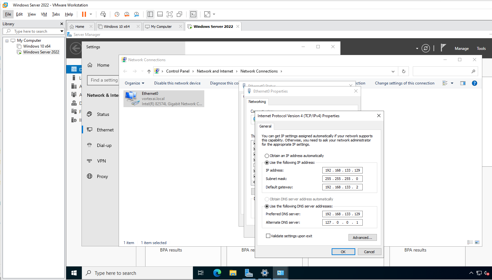
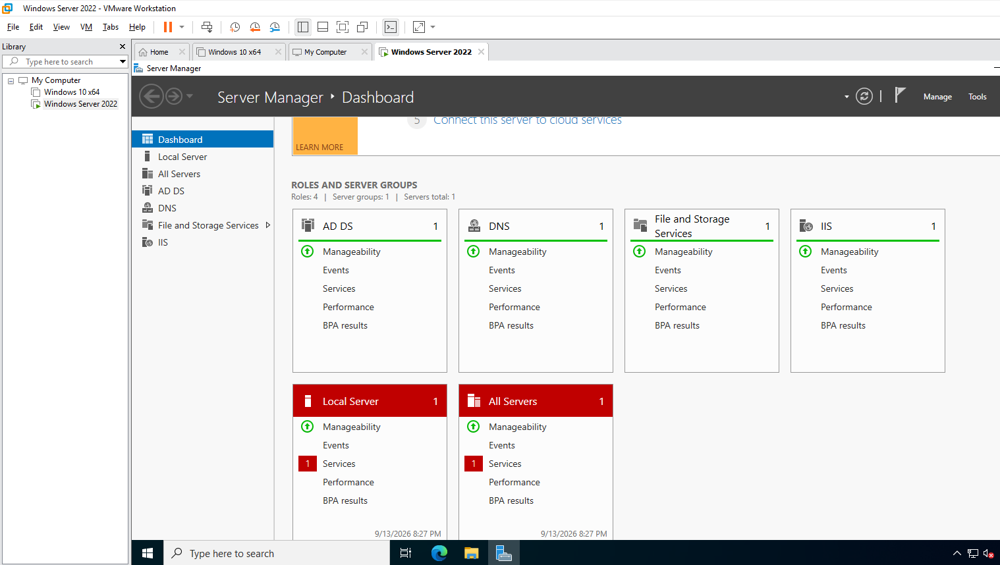
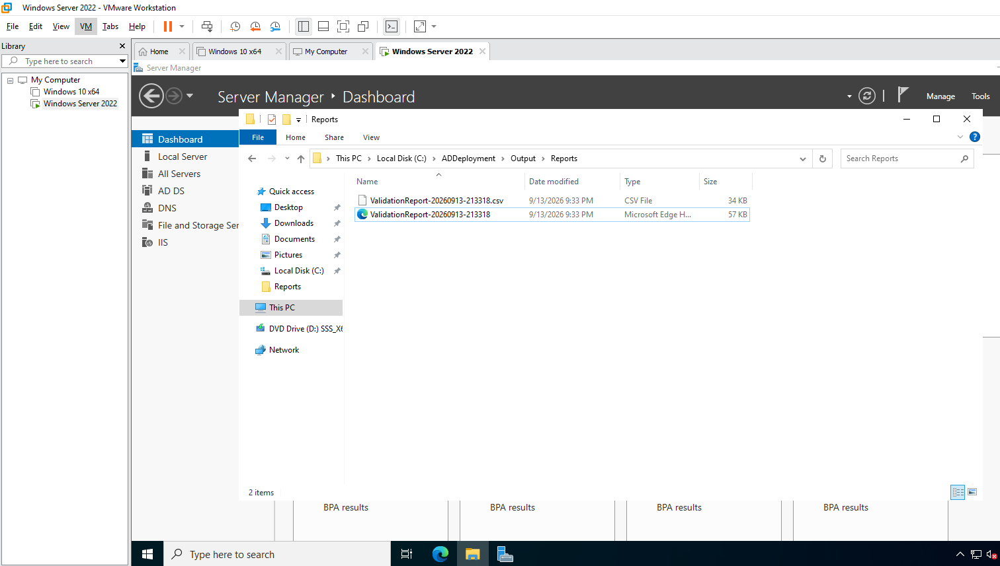
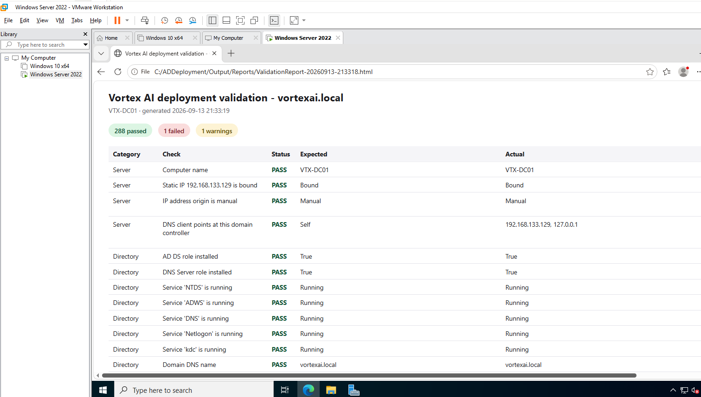
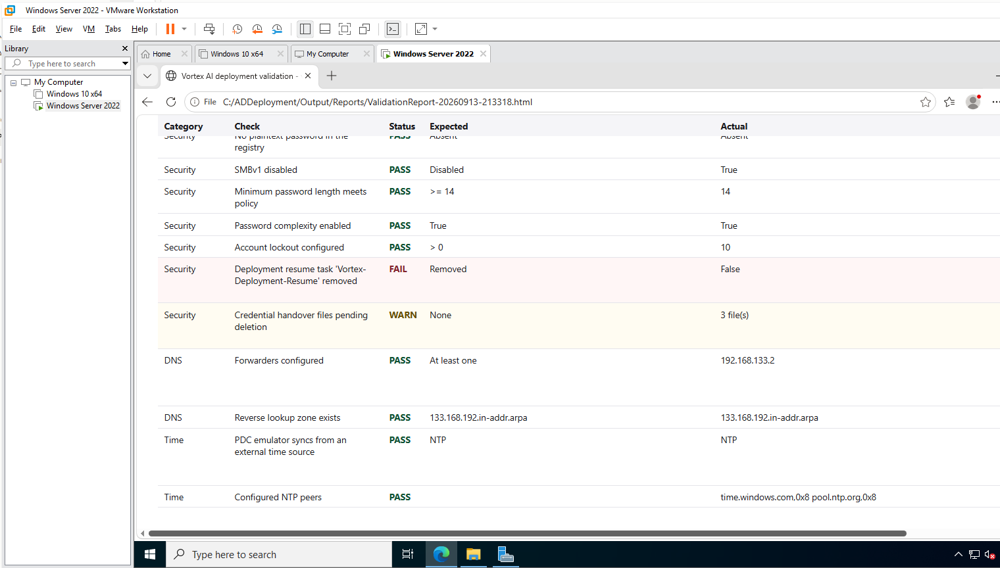

# Lab 04 — Security Baseline and Automated Validation

**Objective:** Apply the day-one security and operational baseline a real domain needs, then
prove the entire build against its configuration with an automated PASS/FAIL report.
**Environment:** `VTX-DC01`, domain `vortexai.local`.
**Prerequisites:** Lab 03.
**Automation:** [`4-Baseline.ps1`](../../Deployment/Scripts/Stages/4-Baseline.ps1) and [`5-Validate.ps1`](../../Deployment/Scripts/Stages/5-Validate.ps1), unattended as `SYSTEM`; re-runnable any time with `Invoke-Deployment.ps1 -Only 5`.
**Duration:** Approximately 5 minutes, unattended.

---

## 1. Scenario

"The script finished" and "the build is correct" are different claims, and the original
three-script kit this project replaced could only make the first. The requirement is a baseline
that makes the domain survivable — recoverable deletions, working name resolution, a trustworthy
clock, enforced password policy, useful audit events — and a validator that queries the finished
server and compares every setting against the configuration that asked for it.

---

## 2. Design decisions

| Decision | Options considered | Selected | Rationale |
|---|---|---|---|
| AD Recycle Bin | Enable later; enable at build | At build | It can only ever be enabled, never disabled, and deletions before it is on lose their attributes and memberships. |
| Time source | VMware Tools host sync; Windows Time from external NTP | PDC emulator from `time.windows.com` and `pool.ntp.org`; VMware sync disabled | The forest-root PDC emulator is the clock the domain follows; past five minutes of skew Kerberos refuses tickets. Two sources fighting over the clock is worse than either. |
| Password policy timing | Before account creation; after | After | Generated initial passwords are not evaluated against a stricter policy mid-build. |
| Validator dependencies | Pester on the server; no dependencies | No dependencies | A freshly built server has no internet access and no modules installed. Stage 5 is plain PowerShell; the Pester suite reuses the *same* validation function on workstations and CI, so the two cannot drift. |
| Validator failure mode | Stop on first error; isolate each section | Isolate each section (`Invoke-CheckSection`) | A validator that dies reports nothing *and* hides what it had already found. A broken section becomes a `FAIL` row naming the section. |
| Report format | Console only; CSV; HTML | HTML and CSV, plus Application event log entries | HTML for a person, CSV for diffing between runs, event log for monitoring. |

---

## 3. Implementation

### Step 1 — Baseline (Stage 4)

Each step is non-critical where a failure is survivable, so one unavailable subsystem does not
cost the rest of the baseline; anything that did not apply surfaces in Stage 5.

| Step | Setting |
|---|---|
| AD Recycle Bin | Enabled forest-wide |
| DNS forwarders | Resolver recorded in Stage 1 (`192.168.133.2`) |
| Reverse lookup zone | `133.168.192.in-addr.arpa` |
| DNS scavenging | Enabled |
| Time | VMware Tools time sync off; PDC emulator → external NTP |
| Password and lockout policy | Length 14, complexity, history 24; lockout after 10 attempts |
| Advanced audit policy | Logon, Logoff, Account Lockout, Credential Validation, User Account Management, Security Group Management, Directory Service Changes |
| SMBv1 | Confirmed disabled |
| Remote Desktop | Enabled with Network Level Authentication |
| Windows Server Backup | Feature installed, system state job staged (see limitations) |

The addressing Stages 1 and 3 applied: the DHCP lease pinned as a static `192.168.133.129/24`,
and the DNS client pointed at the DC's own address with loopback as the alternate.

All four roles reporting healthy manageability. The Local Server tile flags one service — see
§5.3.

---

### Step 2 — Validation (Stage 5)

Stage 5 output: a timestamped CSV and HTML report under `Output\Reports`.

The report for `vortexai.local` on `VTX-DC01`: **288 passed, 1 failed, 1 warning**. The first rows
assert server identity and addressing — computer name, static IP bound, IP origin `Manual`, DNS
client pointing at itself — and that NTDS, ADWS, DNS, Netlogon and KDC are running.

The security, DNS and time sections: no plaintext password in the registry, SMBv1 disabled,
password length 14, complexity on, lockout threshold 10, forwarders and the reverse zone present,
and the PDC emulator syncing from NTP. The one `FAIL` and one `WARN` are explained in §5.

Beyond what is visible here, the report walks every OU distinguished name, every user's OU and
UPN, every group's scope and nesting, each folder's ACL rights **and inheritance flags**, share
existence, FTP state and audit subcategories.

---

## 4. Verification

| Check | Command | Success criterion |
|---|---|---|
| Recycle Bin | `Get-ADOptionalFeature 'Recycle Bin Feature' \| Select EnabledScopes` | Non-empty |
| Time source | `w32tm /query /source` | An NTP peer, not `VM IC Time Synchronization Provider` |
| Password policy | `Get-ADDefaultDomainPasswordPolicy` | `MinPasswordLength 14`, `LockoutThreshold 10` |
| SMBv1 | `Get-SmbServerConfiguration \| Select EnableSMB1Protocol` | `False` |
| Audit policy | `auditpol /get /subcategory:"Logon"` | `Success and Failure` |
| Whole build | `Invoke-Deployment.ps1 -Only 5` | Exit code 0 and no `FAIL` rows |

---

## 5. Faults encountered

### 5.1 FAIL — "Deployment resume task 'Vortex-Deployment-Resume' removed"

**Symptom.** Stage 5 reported the scheduled resume task still registered (`Actual: False`) on an
otherwise complete build.

**Diagnosis.** Traced the task's lifecycle in `Invoke-Deployment.ps1`: it was unregistered only
after *every* stage had completed — and Stage 5 is one of those stages.

**Cause.** A sequencing bug, not a server fault. The assertion ran while the task was necessarily
still registered, so it could never pass on any server.

**Resolution.** The orchestrator now retires the task as soon as no remaining stage requires a
restart — after Stage 3 — which is when it stops having a purpose (2.1.0). **Not re-verified on
this VM:** the report above predates the fix.

### 5.2 WARN — "Credential handover files pending deletion: 3 file(s)"

**Symptom.** Warning, not failure.

**Cause.** Working as designed. The generated initial passwords and DSRM secret are written to
ACL-restricted files under `Output\Secrets` for the operator to distribute. The validator warns
until they are removed so they cannot be forgotten on disk.

**Resolution.** Operator step — distribute, then delete ([runbook §11](../../docs/DEPLOYMENT-RUNBOOK.md)).
The deletion was not captured in this lab's evidence.

### 5.3 Server Manager flagged one service on the Local Server tile

**Symptom.** A red `Services 1` indicator on the Local Server and All Servers tiles.

**Diagnosis.** Not investigated at capture time; the specific service was not recorded. The
validator's own service checks (NTDS, ADWS, DNS, Netlogon, KDC) all passed, and FTP is
deliberately left stopped and disabled.

**Resolution.** Open. Recorded rather than guessed at. `Get-Service | Where { $_.StartType -eq
'Automatic' -and $_.Status -ne 'Running' }` identifies it on the next run.

### 5.4 The report showed `True` for settings that were correctly `False`

**Symptom.** Found on review of report output: a correctly disabled setting read as its own
opposite in the Actual column.

**Cause.** `Add-Boolean` treated an Actual value of `$false` as "nothing supplied" and substituted
the pass condition.

**Resolution.** An empty string still means "nothing worth showing"; `$false` is now reported as
measured (2.1.0).

---

## 6. Capabilities demonstrated

- Domain controller hardening: Recycle Bin, password and lockout policy, advanced auditing, SMBv1
- DNS administration: forwarders, reverse lookup zones, scavenging
- Forest time hierarchy and Kerberos clock-skew awareness in virtualised DCs
- Automated compliance validation with machine-readable and human-readable output
- Honest reporting of a failing check, root-caused to the automation rather than the server

---

## 7. References

| Source | Behaviour confirmed |
|---|---|
| Microsoft Learn — *Active Directory Recycle Bin* | Enable-only behaviour and prerequisites |
| Microsoft Learn — *Configure the PDC emulator as an authoritative time source* | `w32tm` peer configuration |
| Microsoft Learn — *Advanced security audit policy settings* | Subcategory names and events |
| Microsoft Learn — *Detect, enable, and disable SMBv1* | `EnableSMB1Protocol` |

---

## Screenshot checklist

| File | Content |
|---|---|
| `04-01-static-addressing-and-dns-client.png` | Static addressing and DNS client |
| `04-02-roles-dashboard.png` | Role health |
| `04-03-validation-reports-written.png` | Report files |
| `04-04-validation-summary.png` | Report summary and server checks |
| `04-05-validation-security-dns-time.png` | Security, DNS and time checks |
