# Lab 05 — Client Domain Join and Access Verification

**Objective:** Prove the directory works from the consumer's side: join a Windows client to the
domain, sign in as an account the automation created, and confirm authentication and access from
the domain controller's own records.
**Environment:** `VortexAI-PC` (Windows 10 x64, `192.168.133.128`, DHCP) and `VTX-DC01`.
**Prerequisites:** Labs 03 and 04.
**Automation:** None — this lab tests the automation's output from outside it.
**Duration:** Approximately 30 minutes.

---

## 1. Scenario

Object existence on the server is easy to demonstrate and proves little. A directory is only
working when a real client can find it, join it, authenticate against it with an account that was
never touched by hand, and be held to the rules the build applied. This lab takes a clean Windows
10 VM through that path and then reads the evidence back from the domain controller.

---

## 2. Design decisions

| Decision | Options considered | Selected | Rationale |
|---|---|---|---|
| Client DNS | Leave the VMware NAT DHCP DNS (`.2`); point at the DC | Point at the DC (`192.168.133.129`), keep DHCP addressing | Domain join locates a DC through DNS SRV records, which only the DC's DNS holds. VMware's NAT DHCP hands out its own resolver and cannot be given a scope option, so DNS is set on the client. |
| Join credential | Domain Administrator; a delegated join account | Domain Administrator | Acceptable on an isolated lab client. Production uses a least-privilege account delegated *Create Computer objects* on the Workstations OU — listed under limitations. |
| Test account | A new account; one created by Stage 3 | `malik`, created by Stage 3 from the CSV | Tests the automation's output, including its generated password and change-at-first-logon flag. |
| Evidence source | Client screenshots only; DC security log | Both | The DC's Kerberos and logon events are independent of anything the client displays. |

---

## 3. Implementation

### Step 1 — Point the client at the domain's DNS

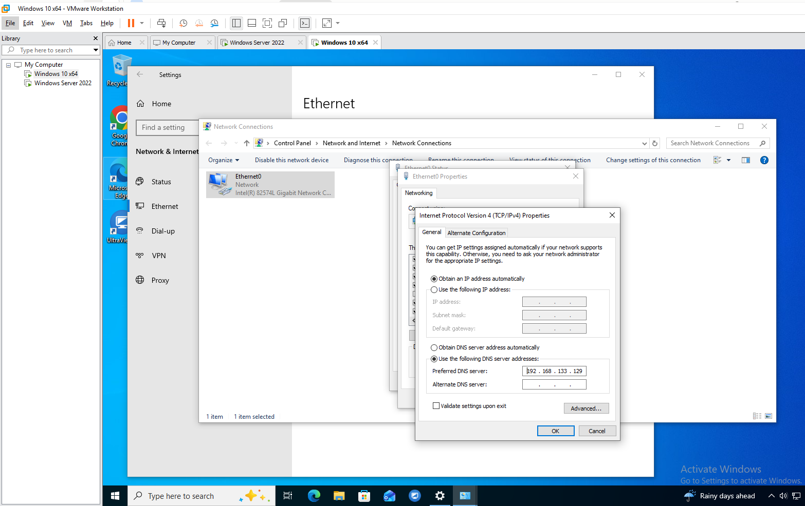

Addressing left on DHCP; the preferred DNS server set manually to the domain controller.

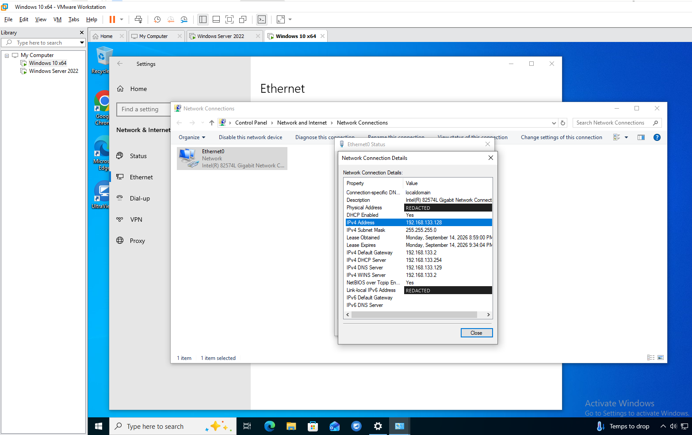

The resulting configuration: DHCP address `192.168.133.128` from the NAT service, gateway `.2`,
DNS `192.168.133.129`. MAC and link-local IPv6 addresses redacted.

---

### Step 2 — Join the domain

**Settings → System → About → Rename this PC (advanced) → Change**, computer name `VortexAI-PC`,
domain `vortexai.local`.

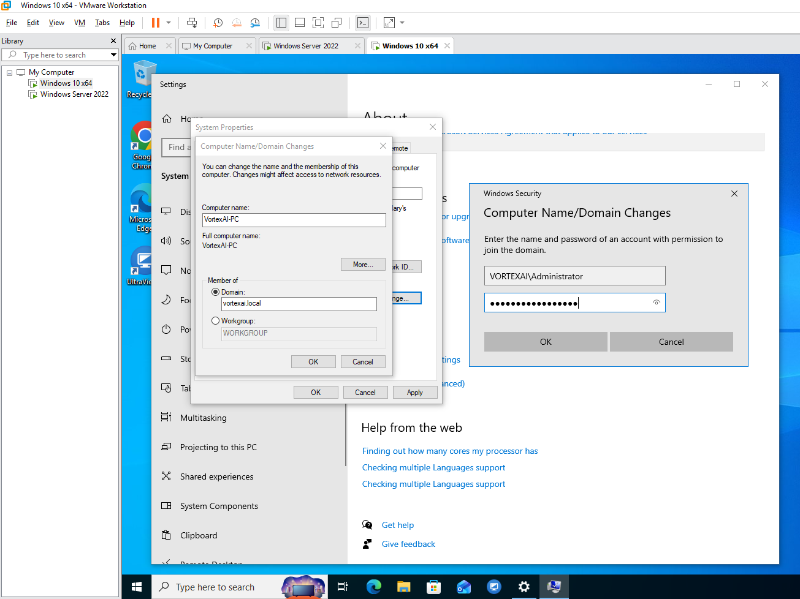

The join authorised with a domain account — the name resolution and DC discovery behind this
prompt only work because of Step 1.

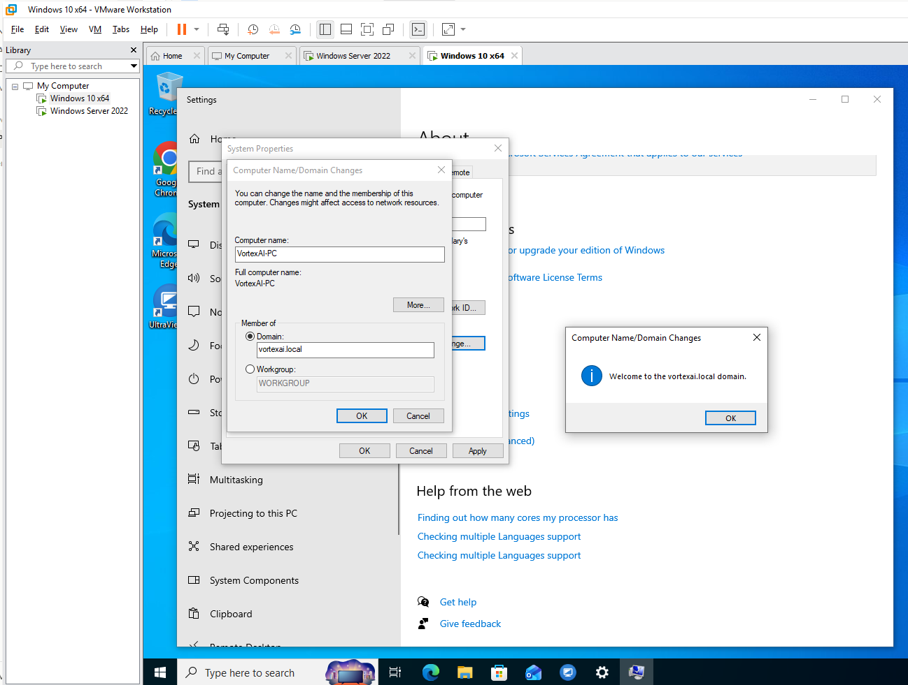

Join confirmed. The client restarts to complete it.

---

### Step 3 — Sign in as an automation-created account

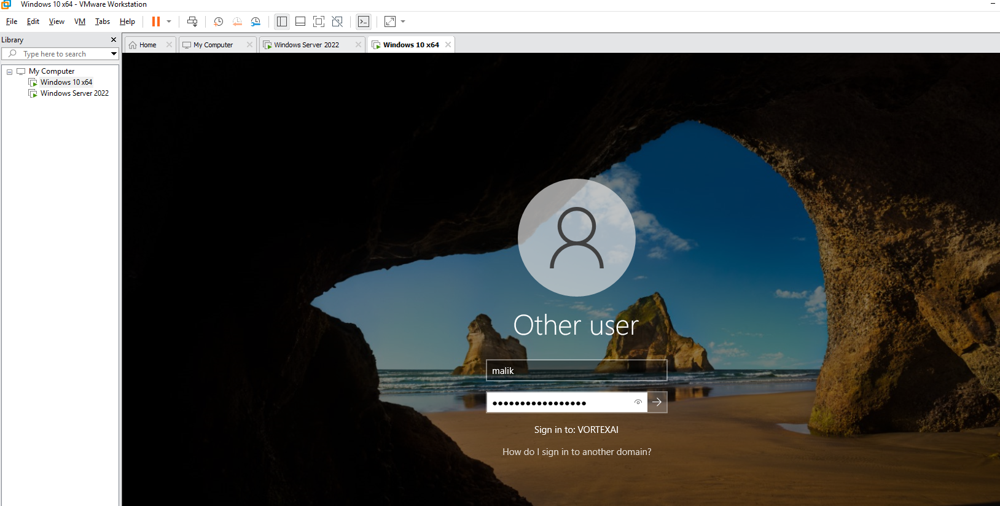

`malik` signing in to `VORTEXAI` with the password Stage 3 generated.

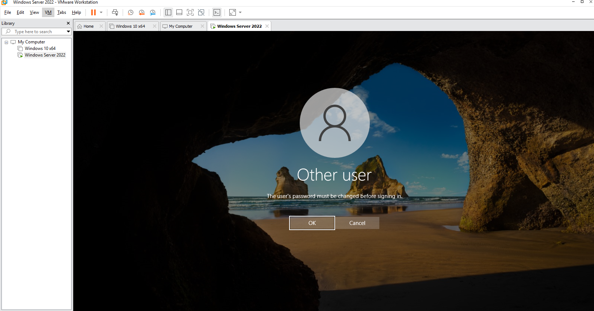

The generated password is refused as a final credential: `ChangePasswordAtLogon` from the build is
enforced. (This prompt and the next were captured at the domain controller's console.)

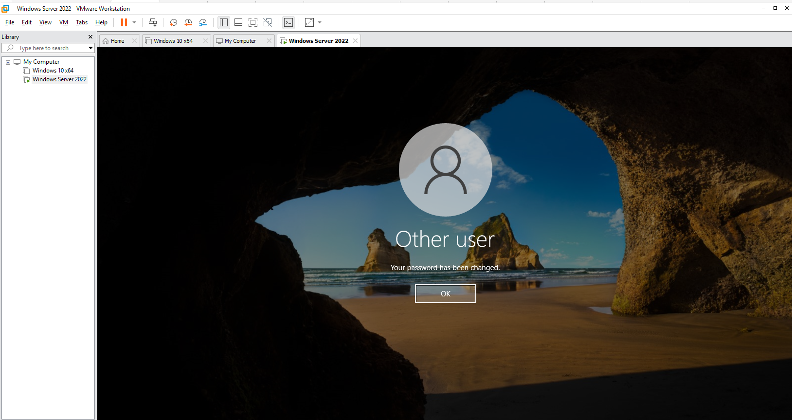

A new password set by the user; the generated value is now useless.

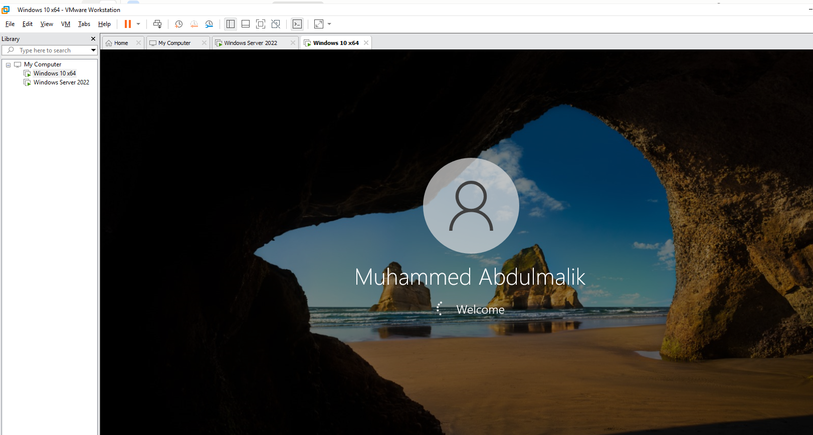

The domain profile loading on `VortexAI-PC`, showing the display name populated from the CSV.

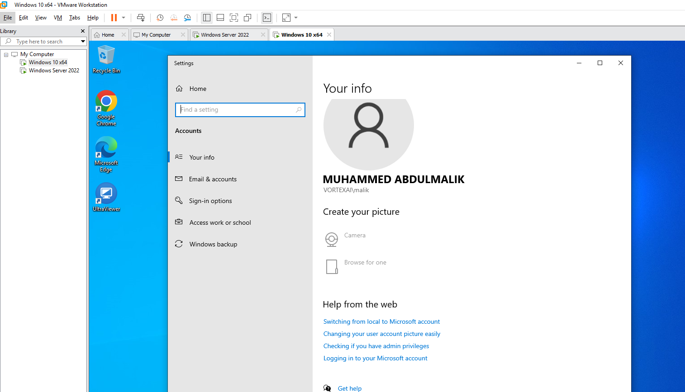

Signed in as `VORTEXAI\malik` — a domain identity, not a local account.

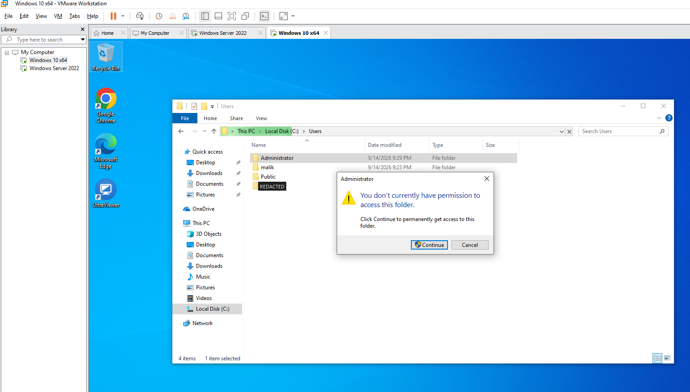

A standard domain user refused access to another profile on the workstation. This shows the account
holds no local administrative rights; it is **not** a test of the share ACLs built in Lab 03 — see
§5.1. The host's local profile folder name is redacted.

---

### Step 4 — Read the evidence back from the DC

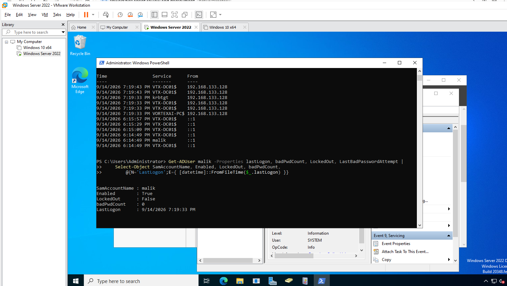

The domain controller's view: Kerberos requests from the client's address (`krbtgt`, the
`VORTEXAI-PC$` computer account) at the moment of sign-in, and `Get-ADUser malik` reporting
`Enabled True`, `LockedOut False`, `badPwdCount 0`, and `LastLogon` matching that sign-in.

```powershell
$user  = 'malik'
$types = @{ 2 = 'Console'; 3 = 'Network/share'; 7 = 'Unlock'; 10 = 'RDP'; 11 = 'Cached' }

Get-WinEvent -FilterHashtable @{ LogName = 'Security'; Id = 4624, 4625, 4634; StartTime = (Get-Date).AddHours(-12) } |
    ForEach-Object {
        $d = @{}; ([xml]$_.ToXml()).Event.EventData.Data | ForEach-Object { if ($_.Name) { $d[$_.Name] = $_.'#text' } }
        if ($d.TargetUserName -eq $user) {
            [pscustomobject]@{
                Time  = $_.TimeCreated
                Event = switch ($_.Id) { 4624 { 'Logon OK' } 4625 { 'Logon FAILED' } 4634 { 'Logoff' } }
                Type  = $types[[int]$d.LogonType]
                From  = if ($d.IpAddress -and $d.IpAddress -ne '-') { $d.IpAddress } else { $d.WorkstationName }
            }
        }
    } | Sort-Object Time -Descending | Format-Table -AutoSize
```

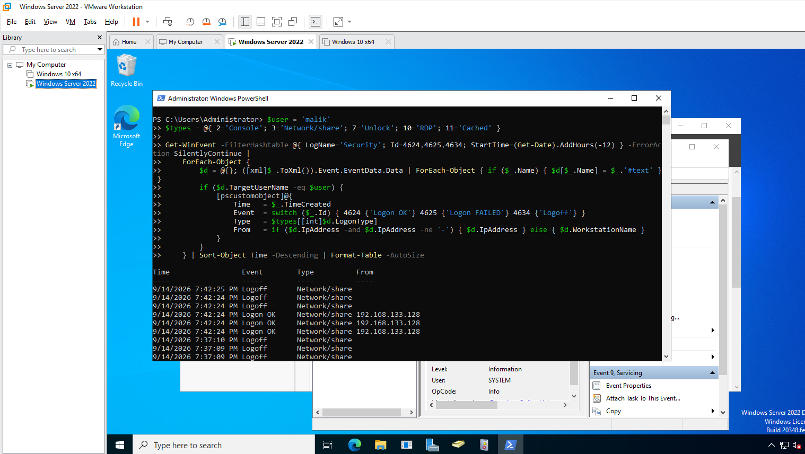

`malik`'s logon history parsed from the Security log: successful `Network/share` logons from the
client and matching logoffs, recorded because Stage 4 enabled the Logon/Logoff audit
subcategories. No `Logon FAILED` rows appear in the captured window.

---

## 4. Verification

| Check | Command | Success criterion |
|---|---|---|
| Client joined | On the DC: `Get-ADComputer VortexAI-PC` | Object exists, `Enabled True` |
| Secure channel | On the client: `Test-ComputerSecureChannel -Verbose` | `True` |
| Account state | `Get-ADUser malik -Properties LockedOut, badPwdCount, PasswordLastSet` | Not locked, `PasswordLastSet` after the build |
| Signed-in identity | On the client: `whoami /groups` | `ROLE_AllStaff`, `ROLE_IT`, `ROLE_Winnipeg` present |
| Audit trail | Event query above | `Logon OK` from the client address |

Evidenced above: the join (welcome dialog and `VORTEXAI-PC$` Kerberos requests), account state, and
the audit trail. `Get-ADComputer`, `Test-ComputerSecureChannel` and `whoami /groups` were not captured.

---

## 5. Faults encountered

### 5.1 Gap: share-level effective access was not captured

**Symptom.** None — a gap found on review of the evidence. The access-denied screenshot shows local
profile protection on the workstation, not the AGDLP permissions on the file server.

**Diagnosis.** The Step 4 event trace shows `malik` making network/share logons from the client,
but not which shares were opened or whether any were refused.

**Resolution.** Recorded as the outstanding test for this lab rather than overstated. The test that
closes it, as `malik` (IT, Winnipeg) on the client:

```powershell
Get-ChildItem \\VTX-DC01\IT        # expected: allowed  (ROLE_IT -> RES_IT_Modify)
Get-ChildItem \\VTX-DC01\Finance   # expected: denied   (no Finance role)
Get-ChildItem \\VTX-DC01\Calgary   # expected: denied   (Winnipeg branch)
```

The same rules are already asserted server-side by Stage 5 (ACL rights and inheritance per
folder) and by the Pester AGDLP tests on every push.

---

## 6. Capabilities demonstrated

- Windows client domain join and DNS-based DC discovery
- Enforcing and demonstrating single-use initial passwords
- Kerberos and logon auditing: reading 4624/4625/4634 events with structured parsing
- Account troubleshooting with `Get-ADUser` (lockout, bad password count, last logon)
- Separating what evidence proves from what it does not

---

## 7. References

| Source | Behaviour confirmed |
|---|---|
| Microsoft Learn — *How domain controllers are located in Windows* | DNS SRV record lookup during join |
| Microsoft Learn — *4624(S): An account was successfully logged on* | Logon type values and `IpAddress` field |
| Microsoft Learn — *Test-ComputerSecureChannel* | Secure channel verification |

---

## Screenshot checklist

| File | Content |
|---|---|
| `05-01-client-dns-pointed-at-dc.png` | Client DNS set to the DC |
| `05-02-client-lease-details.png` | Client lease details (MAC/IPv6 redacted) |
| `05-03-domain-join-credentials.png` | Domain join |
| `05-04-welcome-to-domain.png` | Join confirmed |
| `05-05-first-domain-sign-in.png` | Domain sign-in |
| `05-06-password-change-required.png` | Change required |
| `05-07-password-changed.png` | Password changed |
| `05-08-profile-loading.png` | Profile loading |
| `05-09-signed-in-as-domain-user.png` | Signed-in identity |
| `05-10-standard-user-denied-admin-profile.png` | Standard user denied |
| `05-11-kerberos-authentication-record.png` | Kerberos and account state from the DC |
| `05-12-logon-event-trace.png` | Logon event trace |
